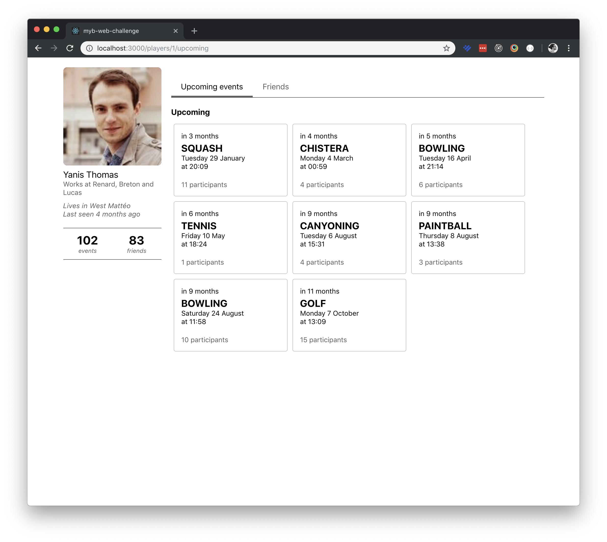

# 

## Instructions

Hello, and welcome to the main repository for the **myb-web-challenge**. This challenge is intended to see how comfortable you are using React, which make up for most of our stack at MYB.

The challenge is divided in multiple levels of increasing difficulty. You have to finish those levels in order, as every level depends on the previous one.

Later in the challenge, you'll need to install [myb-web-challenge-server](moveyourbuddy/myb-web-challenge-server). This is the server you'll talk to when making API calls. Since this is a React challenge, you don't have to implement it yourself. All the instructions and documentation are on the repository.

**Important**

In order for us to verify your progress, you'll need to have at least one commit for each level. You can host your repository publicly on your Github profile, or send us a copy of the entire directory (including the .git directory) at dev@moveyourbuddy.io.

If you have any questions regarding the challenge, don't hesitate to send us a mail at dev@moveyourbuddy.io.

## Let's go!

What you are going to build is a web app where you can simply see the profile of a Player. That's it.

On the Profile page, there is a panel on the left that show basic informations about the Player and two tabs: one that shows all of the upcoming events a Player has, and one that shows all of his/her friends.

<details>
  <summary>
    <b>Screenshots of the app</b>
    <br />
    <br />
  </summary>

  
  

</details>

The app is divided in three main blocks, that we'll build as separate components.

#### `<UserPanel />`

The `UserPanel` is reponsible for presenting basic information about the Player. It is the panel that is located on the left side of the page.

#### `<UpcomingEventsTab />`

The `UpcomingEventsTab` shows, you guessed it, the upcoming events for a player. These events are sorted by date, and grouped in different categories (this week, next week, this month, next month, this year, others).

#### `<FriendsTab />`

This `FriendsTab` simply shows the list of friends a player has. When the User clicks on a Player Card, he's redirected to the Player's profile.

---

### Level #0 - Boilerplate

Since this is the first level, let's start easy.

Create the project structure. We recommend using create-react-app, since it has nice defaults, but you can use something else if you want to.

> **Level #0 - Checklist**
>
> - [ ] Prepare the project structure

---

### Level #1 - Build the UI

Now that you are setup, let's start coding.

First, let's build the UI. Here, we want you to focus only on the styling of the components. The goal is to reproduce the look you can see on the screenshots. This means that you need to use hard-coded data in our components (either from the screenshots, or you can make up your own).

For styling, you can either use plain old css, or a library of your choice (at MYB, we use `react-emotion`).

For now, just show the two tabs at the same time (one under the other). Implementing the "logic" behind the `<TabBar />` is the focus of the next level (spoilers!).

Your `ProfilePage.js` should somewhat look like this:

```javascript
function ProfilePage() {
  return (
    <Container>
      <UserPanel />

      <Content>
        <TabBar>
          <TabBar.Link title="Upcoming events" active />
          <TabBar.Link title="Friends" />
        </TabBar>

        <UpcomingEventsTab />
        <FriendsTab />
      </Content>
    </Container>
  );
}
```

> **Level #1 - Checklist**
>
> - [ ] Create the `<ProfilePage />` component (UI only)
> - [ ] Create the `<UserPanel />` component (UI only)
> - [ ] Create the `<TabBar />` component (UI only)
> - [ ] Create the `<UpcomingEventsTab />` component (UI only)
> - [ ] Create the `<FriendsTab />` component (UI only)

---

### Level #2 - Build `<Tabs />`

Good job! Great, now that we are done pushing pixels, let's implement the Tabs.

Create a `<Tabs />` component, responsible for:

- Holding state about which tab is currently active
- Rendering the Tab Bar
- Rendering the active tab

We expect the component to be used like this:

```javascript
function ProfilePage() {
  return (
    <Container>
      <UserPanel />

      <Content>
        <Tabs>
          <UpcomingEventsTab title="Upcoming events" />
          <FriendsTab title="Friends" />
        </Tabs>
      </Content>
    </Container>
  );
}
```

You can see that the `<Tabs />` component relies on its children to know which tabs to show. It uses the `title` prop on these children to know what to show in the `<TabBar />` component.

By default, it shows the first tab, but when you click on a different tab in the `<TabBar />`, the `<Tabs />` component is responsible for tracking which tab is active and rendering it.

> **Level #2 - Checklist**
>
> - [ ] Implement the `<Tabs />` component

---

### Level #3 - Build `<Fetch />`

All right, well done! Good, now that we have the basics covered, it's time to use some real data. For now, we'll assume that we are viewing the profile of the Player with id=1.

Create a `<Fetch />` component, responsible for making the requests to the API and handling all the different states that can occur.

Then, use it in `<UserPanel />`, `<UpcomingEventsTab />`, and `<FriendsTab />` to show real data about the Player.

We expect the component to be used like this:

```javascript
function UserPanel() {
  return (
    <Fetch path="/players/1">
      {({ isFetching, hasFailed, data }) => {
        // Render our component
      }}
    </Fetch>
  );
}
```

The `<Fetch />` component receives which call to make to the API through its `path` prop. It also takes a render prop as its children to pass the progress and result of the API call.

To make the API calls, you'll need the [myb-web-challenge-server](moveyourbuddy/myb-web-challenge-server). The instructions and documentation are available on the repo.

Don't forget to handle the loading and the error state in your components!

> **Level #3 - Checklist**
>
> - [ ] Implement the `<Fetch />` component
> - [ ] Use `<Fetch />` in `<UserPanel />`
> - [ ] Use `<Fetch />` in `<UpcomingEventsTab />`
> - [ ] Use `<Fetch />` in `<FriendsTab />`

---

### Level #4 - Use a `<Router />`

Okay, now that our components are using data from the server, we can start showing different Player profiles when the User clicks on a Player in the Friends tab.

To do that, you'll need to use a Router. You can use any Routing library your are familiar with. We recommend using `@reach/router`, or `react-router` (but you can use something else).

Here are the routes you need to implement:

- `/`: Redirects to `/players/1/upcoming`
- `/players/:id`: Redirects to `/players/:id/upcoming`
- `/players/:id/upcoming`: Shows the Upcoming Tab
- `/players/:id/friends`: Shows the Friends Tab

This means that we won't use the `<Tabs />` component for keeping track of which tab is active anymore. This is the Router's job now.

> **Level #4 - Checklist**
>
> - [ ] Install the Router of your choice
> - [ ] Get rid of `<Tabs />`
> - [ ] Implement the routes
> - [ ] Allow navigating between Profiles through the `<FriendsTab />`

---

### Level #5 - Congratulations 🎉

Well done! You've finished the **myb-web-challenge**.

If you're still hungry, you can try the bonus level, but it is not required. We still recommend submitting your repo now, and send it again when you're done with the bonus level.

Either way, you can be proud of what you have done! We hope that you had fun and thank you for taking the time to take the challenge. We'll be in touch soon.

---

### Bonus level 💪

All right! You didn't have enough, well we've got more! If you want to show off your skills, now is the time.

Here are a few things that you can do. You are not required to do all of them, but be sure to have at least one commit for every task.

#### Bonus #1. Typing your components

Types are important. They're a way to quickly catch most of the bugs before actually running the code. At MYB, we extensively use `Flowtype`.

Use `Flowtype` to type all of your components. This means declaring each props your components are expecting.

#### Bonus #2. Code-spliting

The more code you write, the bigger it gets. To make sure that the app bundle still loads fast, you can use code-splitting to load your components asynchronously.

Implement code-splitting by using `Suspense` and `lazy` on the different tabs.

#### Bonus #3. Use Hooks

If you've been following the news, there is this new thing in React called Hooks. It's not out yet but you can start using it by upgrading `react` and `react-dom` to `16.7.0-alpha`. (See [Introducing Hooks](https://reactjs.org/docs/hooks-intro.html) on the React website). Hooks are awesome: they make your code leaner, and make it easy to reuse some functionnality accross components.

Rewrite your `<Fetch />` component using `useState` and `useEffect`.

#### Bonus #4. Use `react-cache`

Like Hooks, `react-cache` is not out yet, but you can start using it. `react-cache` allows you to use `Suspense` and `Concurrent mode` to make your components halt rendering when they need to fetch something from the API (for example).

Install `react-cache` and implement a `FetchAPI` using `unstable_createResource`. Start using it in all your components that use the API.

Example:

```javascript
function UserPanel({ playerId }) {
  const response = FetchAPI.read(`/players/${playerId}`);

  return (
    <h1>
      {response.first_name} {response.last_name}
    </h1>
  );
}
```

Notice how cleaner the code is 🤩.
